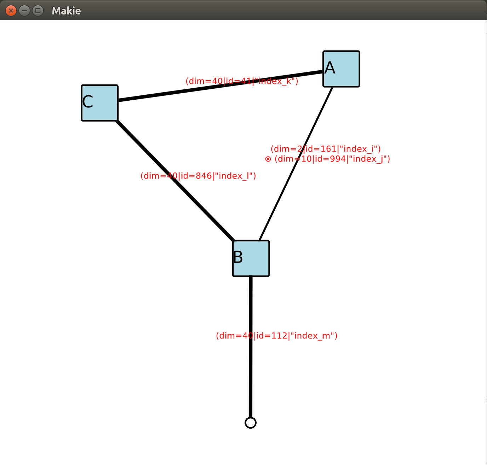
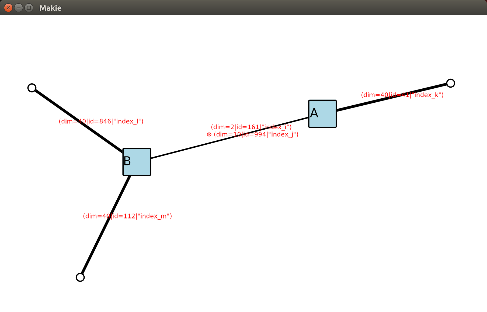
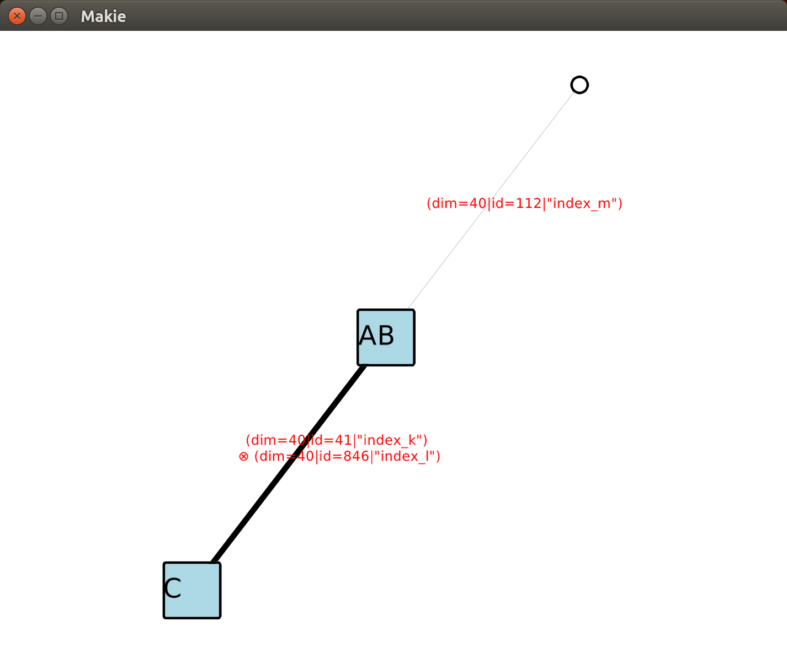

# ITensorsVisualization

This is a package for visualizing tensor networks. The main purpose is to use it with the [ITensors.jl](https://github.com/ITensor/ITensors.jl) package to view and debug tensor network contractions, for example:
```julia
using ITensors
using ITensorsVisualization

i = Index(2, "index_i")
j = Index(10, "index_j")
k = Index(40, "index_k")
l = Index(40, "index_l")
m = Index(40, "index_m")
A = randomITensor(i, j, k)
B = randomITensor(i, j, l, m)
C = randomITensor(k, l)
# Contract the tensors over the common indices
# and visualize the results
ABC = @visualize A * B * C
```



The visualization makes an initial guess for the locations of the tensors, and then allows users to interactively move the tensors to better locations. In addition, you can pause the execution between contractions to analyze intermediate results:
```julia
julia> AB = @visualize A * B pause = true; ABC = @visualize AB * C;
Press C/c and then Enter to continue:
c

```
This will first visualize the contraction `A * B`, wait for the user to respond, and then perform the contraction and continue to visualize and perform contraction `AB * C`. This is helpful for viewing and debugging multistep contractions.




